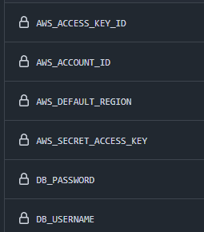

## 🚀 Para que serve o Easy Infra?

O **Easy Infra** foi projetado para provisionar uma infra minimalista para projetos Spring, com todo o básico que uma aplicação na AWS pode ter.  
Os principais serviços provisionados são:

* 🗂️ S3
* 🐳 ECS
* 📦 ECR
* 🖥️ EC2
* 🛢️ RDS (com PostgreSQL)

Dessa forma, sua aplicação irá subir para a nuvem AWS de forma **simples e rápida**. ☁️⚡

---

## 🛠️ O que é necessário para executar o programa?

* 🔧 Terraform instalado
* 🧭 AWS CLI instalada e configurada
* ☕ Um projeto Spring Boot

---

## 📁 O que será gerado?

O **Easy Infra** irá gerar os arquivos Terraform já com todas as configurações necessárias para sua aplicação rodar em um **container** registrado no **ECR**.  
Sua aplicação será executada em um **ECS com uma instância EC2**.

📝 Também será gerado um script dentro da instância EC2, que irá configurar o **Nginx** para habilitar **HTTPS** na sua aplicação **sem custos**.

⚙️ Um **workflow do GitHub Actions** será incluído para:

* Criar toda a sua infra com Terraform
* Gerar a imagem Docker da aplicação
* Implantar automaticamente na AWS

🧱 Os arquivos `Dockerfile` e `docker-compose.yml` também podem ser gerados, caso você queira.

---

## 🧪 Primeiros passos:

Execute esses passos antes de iniciar o programa:

1. 🔐 Configure os seguintes **secrets** no seu repositório GitHub:




> ⚠️ **Eles deverão estar com a mesma nomenclatura (nome e case) que aparece abaixo:**

* 🔑 `AWS_ACCESS_KEY_ID`
* 🧾 `AWS_ACCOUNT_ID`
* 🌍 `AWS_DEFAULT_REGION`
* 🔐 `AWS_SECRET_ACCESS_KEY`
* 🗄️ `DB_USERNAME`
* 🔑 `DB_PASSWORD`

2. ☁️ Crie um bucket S3 na AWS com o nome **`terraform-state`**

> ⚠️ Esse bucket será utilizado para armazenar o **estado do Terraform** de forma remota, garantindo que o gerenciamento da infraestrutura seja confiável e compartilhável.

3. 🌐 Você deverá ter um subdomínio configurado para a sua API, esse subdomínio deverá apontar para o **Elastic IP** da sua instância EC2

## 🎉 Pós execução do Easy Infra:

Após executado o programa você deverá configurar o Nginx dessa forma:

1. 🖥️ Acesse a instância EC2 que foi criada
2. ⚙️ Rode esse comando: `sudo /home/ec2-user/configure-ssl.sh`

E pronto sua aplicação estará rodando e você poderar acessar sua API via HTTPS

# 🔐 Como Obter Credenciais da AWS (AWS_ACCESS_KEY_ID, AWS_SECRET_ACCESS_KEY e AWS_ACCOUNT_ID)


## ✅ Pré-requisitos

- Ter uma conta na AWS (https://aws.amazon.com/)
- Ter o AWS CLI instalado ([instalação](https://docs.aws.amazon.com/cli/latest/userguide/install-cliv2.html))

---

## 1. Criando uma nova chave de acesso

### Acesse o Console da AWS IAM:
- Vá para: https://console.aws.amazon.com/iam/
- No menu à esquerda, clique em **Users (Usuários)**

### Selecione um usuário existente ou crie um novo:
- Clique no nome do usuário desejado
- Vá até a aba **Security credentials (Credenciais de segurança)**
- Clique em **Create access key (Criar chave de acesso)**

### Salve suas credenciais:
Você verá os seguintes dados:
- **AWS_ACCESS_KEY_ID**
- **AWS_SECRET_ACCESS_KEY**

> ⚠️ Salve essas informações em um local seguro. Você **não poderá visualizar o SECRET novamente** depois de sair da tela.

---

## 2. Obter o AWS_ACCOUNT_ID

Você pode obter seu AWS Account ID das seguintes maneiras:

### Usando o Console Web:
1. Acesse https://console.aws.amazon.com/billing/home
2. No canto superior direito, clique no nome da sua conta e depois em **"My Account" (Minha Conta)**
3. Você verá seu **Account ID** na parte superior da página

### Usando AWS CLI:
```bash
aws sts get-caller-identity --query "Account" --output text
```

---

## 💡 Dica: Configurar credenciais no CLI

Se quiser usar suas credenciais no terminal:
```bash
aws configure
```

Você será solicitado a inserir:
- AWS Access Key ID
- AWS Secret Access Key
- Região padrão (ex: `us-east-1`)
- Formato de saída (ex: `json`)

---

## 🔐 Segurança

- Nunca compartilhe suas chaves com ninguém
- Use variáveis de ambiente ou arquivos de configuração seguros
- Revogue chaves não utilizadas regularmente

# 🌐 Como Criar um Subdomínio e Apontá-lo para o Elastic IP da Instância EC2 na Hostinger

## 🛠️ Passos para Criar o Subdomínio e Configurá-lo

### 1. 🔑 Obter o Elastic IP da sua Instância EC2

Primeiro, você precisa garantir que sua instância EC2 tenha um **Elastic IP** (EIP) atribuído. Isso garante que o endereço IP da instância não mude, mesmo após reinicializações.

1. Acesse o **Console da AWS**.
2. No menu **EC2**, clique em **Elastic IPs**.
3. Selecione o EIP recém-criado e clique em **Associar** com a instância EC2 que você está usando.

### 2. 📝 Criar o Subdomínio na Hostinger

Agora que você tem o Elastic IP, o próximo passo é criar um subdomínio que aponte para esse IP através da **Hostinger**.

#### Passo a Passo:

1. **Acesse o Painel de Controle da Hostinger**:
 - Vá para o [site da Hostinger](https://www.hostinger.com.br) e faça login na sua conta.
 - No painel de controle, clique em **Gerenciar** ao lado do domínio para o qual você deseja criar o subdomínio.

2. **Crie o Subdomínio**:
 - No painel de controle da Hostinger, acesse a seção **Subdomínios**.
 - No campo **Nome do subdomínio**, digite o nome que deseja (por exemplo, `api`).
 - No campo **Selecionar domínio**, escolha o domínio principal (ex: `seudominio.com`).
 - Clique em **Criar**.

   Isso criará o subdomínio desejado, como `api.seudominio.com`.

### 3. 🧭 Configurar o Subdomínio para Apontar para o Elastic IP

Agora que o subdomínio foi criado, você precisa configurá-lo para apontar para o Elastic IP da sua instância EC2.

1. **Acesse a seção de DNS**:
 - No painel da Hostinger, vá até a seção **Gerenciamento de DNS**.
 - Você verá uma lista de registros DNS para o seu domínio.

2. **Adicione um Registro A**:
 - No painel de gerenciamento de DNS, clique em **Adicionar Novo Registro**.
 - Selecione **A** como o tipo de registro.
 - No campo **Nome**, insira o nome do subdomínio que você criou (ex: `api`).
 - No campo **Endereço IPv4**, insira o **Elastic IP** da sua instância EC2.
 - Salve as configurações.

3. **Aguarde a Propagação do DNS**:
 - As alterações no DNS podem levar de alguns minutos a até 48 horas para se propagarem completamente. Durante esse período, seu subdomínio pode não estar acessível de imediato.

### 4. 🔄 Testar a Configuração

Após a propagação do DNS, você poderá acessar o seu subdomínio (`api.seudominio.com`) e ele deverá redirecionar corretamente para a sua instância EC2.

1. Abra o navegador e digite o subdomínio configurado.
2. Se tudo estiver correto, sua aplicação estará acessível através do novo subdomínio!

## 🚨 Possíveis Erros

- **DNS não propagado**: Se não conseguir acessar o subdomínio imediatamente, aguarde mais tempo, pois a propagação do DNS pode levar até 48 horas em alguns casos.
- **Configuração incorreta no Hostinger**: Certifique-se de que o **Elastic IP** foi inserido corretamente.
- **Erro de acesso**: Verifique se a segurança do seu grupo de segurança EC2 permite tráfego na porta necessária (ex: 80 ou 443 para HTTP/HTTPS).

Agora você tem um subdomínio funcional apontando para a sua instância EC2 na AWS! 🚀

